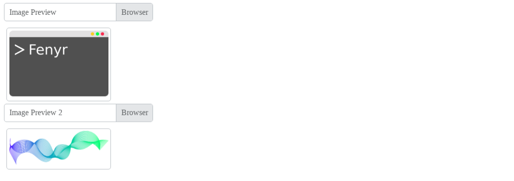

# Image Preview JS

Image Preview JS is a JavaScript module to preview images.

## Installation

Download or clone the repository.

~~~git
git clone https://github.com/fenyr-sh/image-preview-js.git
~~~

You can also download it using npm.

~~~npm
npm i image-preview-js
~~~

## Usage

Add the **dist/js/app.js** file to your site.

~~~html

~~~

Optionally you can include the stylesheet **dist/css/app.css**.

~~~html
<link rel="stylesheet" href="dist/css/app.css">
~~~

### Example

The input must contain a `preview` attribute where the value of the attribute must
be equal to the `id` of the container where the images will be displayed.

~~~html
<!-- Image Preview -->

    <label class="custom-preview-label" for="">Image Preview</label>
    <input class="custom-preview-input" type="file" name="" id="" preview="image-preview">

<!-- Image Preview 2 -->

    <label class="custom-preview-label" for="">Image Preview 2</label>
    <input class="custom-preview-input" type="file" name="" id="" preview="image-preview2">

~~~

## Screenshot

